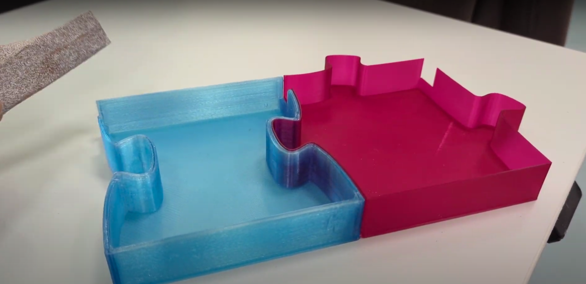

# LED illuminated "P" letter

Jacob Seifert  
In this project, I will describe the tools to realize the P character in the LPL logo. The initial idea was to 3D print puzzle pieces that form the letter "P" (at 60 cm height) with background LED illumination.

## Tools:
- Inkscape (open source software)
- Fusion360 and TinkerCAD (freeware from Autodesk)
- 3D printers
- glue
- LED strip (bought from here)

Design files: published here (Zip file, 2.1 MiB)

<b>Step 1:</b> Use Inkscape to draw the puzzle pieces as vector graphics (SVG)

<b>Step 2:</b> Use Fusion360 and Autodesk to transform the SVG into STL files.
- Import SVG to Fusion360. Extend the surface to 25 mm in height. Use the shell command with 3 mm thickness. lower the base plate by 2 mm to achieve a front surface thickness of 1 mm (as this was tested to look nice with background LEDs)
- Export STLs to TinkerCAD. There, add the "Letter Mount" object (see Zip file in the Feed section of this project) to at least three puzzle pieces to mount later to a wooden board. Also, I've added cutouts to the puzzle shells to route the LED strips through later.

<b>Step 3:</b> 3D print those puzzle pieces (also included in the Zip file)

  

<figcaption>Figure: Individual 3D printed pieces<figcaption>
 

<b>Step 4:</b> Glue the LED strips into the puzzle pieces following a continuous curve. Done.

  

<figcaption>Figure: Lights routed throughout the letter and glued down<figcaption>
 

## Additional information
	• Short Name: #LEDilluminatedPletter
	• Created on: March 17, 2023
Keywords: 3d-printing; making; Digital design and fabrication
