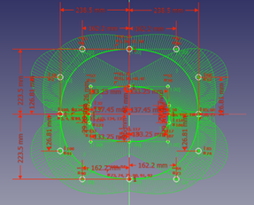
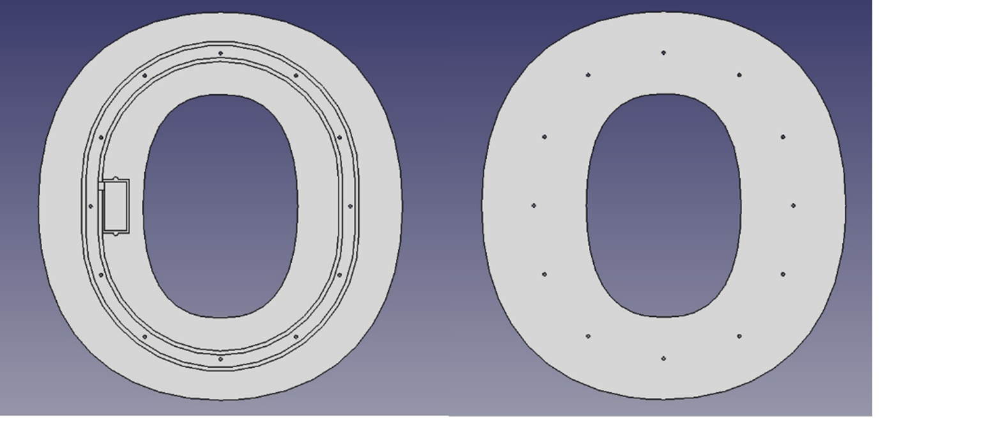
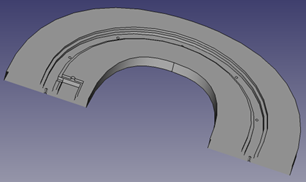

<b>Oklok: Neopixel-based digital-analogue clock</b> 
Nico

In this project the fabrication of a Neo-pixel based analogue clock shaped as the letter "O" is described: "Oklok", as part of the “Lili’s Proto Lab”-sign challenge. The theme of the letter is “CNC, WiFi”.

Restraints:
- Font: OpenSans-ExtraBold.ttf, height 477 mm
- Available power: 12V / 1.5A

Material:
- Plywood 24.4 mm 
- PVC 4 mm
- ESP8266MOD 12-F D1 Mini
- TSR1-2450, DC/DC converter 12V->5V
- 12x APA106 diffused RGB-leds 8mm
- IRLZ34N, logic level power mosfet
- Flexible Neon-like ledstrip 12V (backlight) 
- Tactile switch
- Led (red) 3mm
 
Tools:
- FreeCad
- CNC router
- Arduino IDE
- Soldering station

Step1:
The letter is designed in FreeCad.
 

  
  
   <figcaption>Figures: Parametric sketch (left) and 3D model of O (right)<figcaption>

  
   <figcaption>Figure: Cut-through view of the O<figcaption>

From this, several gcode-files are generated for the CNC-router: outline, back, and drill holes for the RGB leds.
The edges are rounded with a handheld router.
The surface is polished with a sanding machine, and coated with Danish oil.
 
Step 2:
The ESP8266 is programmed with the Arduino IDE.
See schematics for the connections.

  
   <figcaption>Figure: Cut-through view of the O<figcaption>

Input voltage is 12V.
The voltage can be used for the backlight lightstrip, but has to be converted to 5V by U101 to supply the ESP8266 and the 12 smart rgb-leds (APA106). 
Q101 is a power mosfet that reduces the light output of the strip by means of pulse width modulation. 
At startup, the ESP8266 goes into “station mode”, and tries to connect to a previously saved access point (SSID/password combination). 
If this fails (or after pressing switch SW101 for more than 5s), it sets the ESP to “access point” mode. Using any Wi-Fi enabled device with a browser, connect to the newly created Access Point (default name "Lili's OClock WiFi manager"), configure the WiFi (SSID/password) and save it. Then these settings will be used in the future.

	  
Additional information 
	
• Short Name: #Oklok

	
• Created on: September 28, 2023

	
• Last update: October 5, 2023

Keywords: Neopixel; Esp32; Clock

