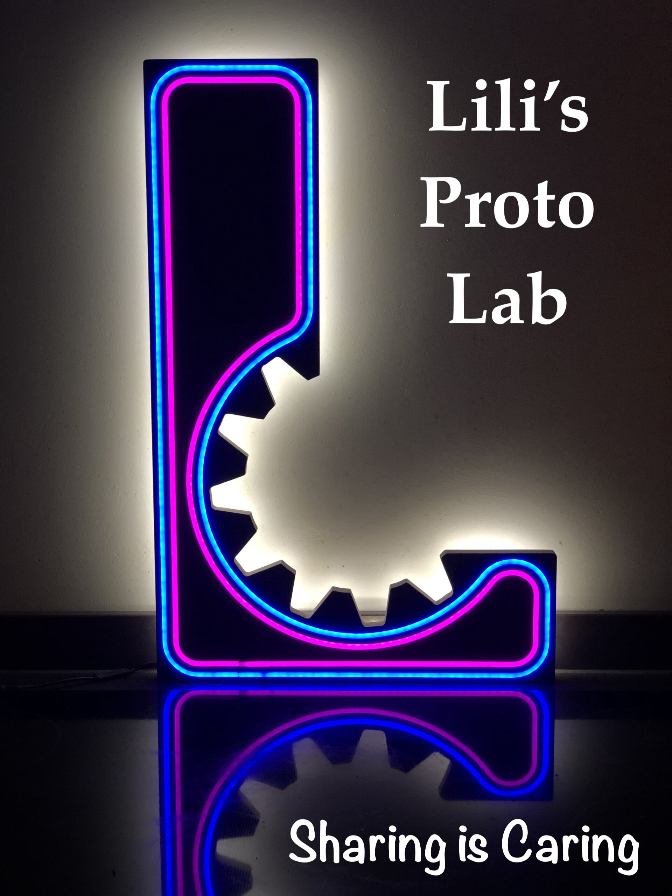

# Lili's Proto Lab signage letters
The lab shop front is decorated with brightly illuminated letters inspired by diverse topics from engineering/science/prototyping. Each letter is handmade by a member of the team and serves as a right-of passage.

  
  <figcaption>Figure: LPL shop front with current and future letters<figcaption>

## Main features
L - the first letter of our name, the letter that started it all. Lennart built this with our Shaper Origin router.
P - Jacob created this puzzle-inspired letter. 3D printed from transparent PLA it lights up like no other.
O - Central in our shop front, Nico created a O-shaped digital analogue clock using Neopixels.
T - Integrating old circuitry, epoxy casting and acrylic processing, Josh built an ever color-shifting T.
L - Inspired by Nature, Pieter created this amalgamation from a tree, laser-cut acrylic and RGB lights.

## Build instructions
_Guide the reader with the order of browsing your project repository for an optimum building experience_
 
When you want to start a new repository, it is better that you copy this repository to your project repository and start by changing all the description.
All instructions and (sub)headers are suggestions. You can change the style, order, or composition as you see necessary. 

It would be kind if you put a shortcut to your Bill of Materials file.
This template can be copied free of charge. 

## Outcomes
_Here you can list the outcomes of the project that you would like to hightlight. It does not need to be an exhaustive list_

We will list some best practices and good examples from projects that have used this template for their documentation.

## Team
+ Contributors:
	+ Lennart Herlaar
 	+ Jacob Seifert
  	+ Nico van Hijningen
  	+ Josh Hauser
  	+ Pieter Kooijman

## License

This project is released under CC0 1.0 Universal. 
You can modify an reuse as you like.
The project team appreciates your suggestions or examples for enhancing the repository, but your consistent documentation of your project is the best gift to the world. Hopefully, this template could make that a bit easier for you. 

